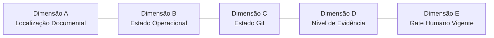

# Ciclo de Vida de Tarefas e Governança em 5 Dimensões

## 1. As 5 Dimensões Independentes de Governança

Para evitar ambiguidade e garantir rastreabilidade, o estado de qualquer iniciativa no Monvi Brain é avaliado em 5 dimensões ortogonais e independentes:

### Dimensão A: Localização Documental
- `00_SYSTEM/tasks/active/`: Tarefas em elaboração, autorização ou execução.
- `00_SYSTEM/tasks/done/`: Tarefas formalmente encerradas e arquivadas.

### Dimensão B: Estado Operacional
- `proposed`: Ideia ou rascunho de escopo apresentado;
- `scoped`: Escopo técnico delimitado com critérios de aceite e paths definidos;
- `authorized`: A implementação do escopo delimitado recebeu o gate humano explícito correspondente. A aprovação da task ou da decisão, isoladamente, não autoriza implementação;
- `implementing`: Modificações autorizadas em andamento;
- `validating`: Execução de validações e compilações de testes;
- `review`: Implementação concluída aguardando revisão de diff e aprovação de commit pelo CEO;
- `verified`: Alterações mescladas na `main` e verificadas em ambiente sincronizado;
- `done`: Tarefa encerrada formalmente por gate executivo;
- `blocked`: Tarefa impedida por dependência ou decisão externa;
- `partial`: Entrega parcial autorizada e delimitada;
- `remediation_required`: Necessidade de correção identificada após falha de validação ou gate;
- `rejected`: Proposta de tarefa rejeitada pela liderança;
- `cancelled`: Tarefa cancelada antes da conclusão;
- `superseded`: Tarefa substituída por nova iniciativa.

### Dimensão C: Estado Git
- `uncommitted`: Alterações apenas no working tree local (staging vazio);
- `committed`: Alterações com commit criado na branch local da task;
- `pushed`: Commit enviado para o repositório remoto (`origin`);
- `pull_request_open`: PR aberto para revisão do CEO;
- `merged`: PR aprovado e mesclado na branch `main`.

### Dimensão D: Nível de Evidência
- Níveis de 1 (`planejado`) a 8 (`encerrado`), conforme especificado em [EVIDENCE-STANDARD.md](EVIDENCE-STANDARD.md).

### Dimensão E: Gate Humano Vigente
- Frase de autorização literal concedida pelo CEO na última interação (ex.: `AUTORIZADA IMPLEMENTAÇÃO DOCUMENTAL DA TASK 046`).

---

## 2. Matriz Completa de Estados Operacionais e Transições

### 1. `proposed`
- **Significado**: Rascunho inicial de proposta de tarefa.
- **Responsável**: Agente ou CEO.
- **Critério de Entrada**: Ideia ou necessidade identificada.
- **Critério de Saída**: Delimitação de escopo e paths.
- **Transições Permitidas**: `scoped`, `rejected`, `cancelled`.
- **Transições Proibidas**: `authorized`, `implementing`, `done`.
- **Evidência Mínima**: `planejado`.
- **Gate Humano Aplicável**: `AUTORIZADA DEFINIÇÃO DE ESCOPO`.

### 2. `scoped`
- **Significado**: Escopo delimitado com critérios de aceite, paths e estimativa de impactos.
- **Responsável**: Agente em alinhamento com o CEO.
- **Critério de Entrada**: Definição textual de escopo aprovada para criação de task.
- **Critério de Saída**: Recebimento de gate explícito de autorização de implementação.
- **Transições Permitidas**: `authorized`, `blocked`, `rejected`, `cancelled`.
- **Transições Proibidas**: `implementing`, `done`.
- **Evidência Mínima**: `planejado`, `documentado`.
- **Gate Humano Aplicável**: `AUTORIZADA CRIAÇÃO CONTROLADA DA TASK XXX`.

### 3. `authorized`
- **Significado**: A implementação do escopo delimitado recebeu o gate humano explícito correspondente. A aprovação da task ou da decisão, isoladamente, não autoriza implementação.
- **Responsável**: CEO (concessor) / Agente (receptor).
- **Critério de Entrada**: Task criada, decisão aprovada (quando exigida) e gate explícito de implementação recebido.
- **Critério de Saída**: Início factual da escrita de código ou documentos autorizados.
- **Transições Permitidas**: `implementing`, `blocked`, `cancelled`.
- **Transições Proibidas**: `verified`, `done`.
- **Evidência Mínima**: `documentado`.
- **Gate Humano Aplicável**: `AUTORIZADA IMPLEMENTAÇÃO DA TASK XXX`.

### 4. `implementing`
- **Significado**: Edições de arquivos autorizados em andamento.
- **Responsável**: Agente.
- **Critério de Entrada**: Gate de implementação ativo e workspace pronto.
- **Critério de Saída**: Conclusão das edições e disparo das suítes de teste/validação.
- **Transições Permitidas**: `validating`, `remediation_required`, `blocked`.
- **Transições Proibidas**: `done`, `verified`.
- **Evidência Mínima**: `implementado`.
- **Gate Humano Aplicável**: `AUTORIZADA IMPLEMENTAÇÃO DA TASK XXX`.

### 5. `validating`
- **Significado**: Execução de suítes de teste, compilação, typecheck e auditoria de evidências.
- **Responsável**: Agente.
- **Critério de Entrada**: Edição de código/documentos concluída.
- **Critério de Saída**: Sucesso em 100% dos testes/validações ou identificação de falha.
- **Transições Permitidas**: `review`, `remediation_required`.
- **Transições Proibidas**: `done`, `merged`.
- **Evidência Mínima**: `testado` / `executado em runtime`.
- **Gate Humano Aplicável**: `AUTORIZADA IMPLEMENTAÇÃO DA TASK XXX`.

### 6. `review`
- **Significado**: Implementação local e validações concluídas, conteúdo aguardando ou passando por revisão humana. A task permanece operacionalmente em `review` durante toda a integração Git (preparação de commit, commit, push, abertura de PR, revisão de PR). A Dimensão C registra separadamente a progressão Git (`uncommitted` → `committed` → `pushed` → `pull_request_open` → `merged`).
- **Responsável**: CEO.
- **Critério de Entrada**: Validações bem-sucedidas e audit de execução local produzido.
- **Critério de Saída**: Merge concluído na `main` e verificação pós-merge aprovada.
- **Transições Permitidas**: `verified` (após merge + verificação pós-merge), `remediation_required`, `rejected`.
- **Transições Proibidas**: `done` (sem merge/verificação), `authorized` (commit/push/PR não são retorno ao estado authorized).
- **Evidência Mínima**: `documentado`, `testado`.
- **Gate Humano Aplicável**: `APROVADO CONTEÚDO E DIFF DA TASK XXX`.

### 7. `verified`
- **Significado**: Alterações mescladas na branch `main` e verificadas em ambiente limpo e sincronizado.
- **Responsável**: CEO e Agente.
- **Critério de Entrada**: Commit mesclado na main e `git pull` executado.
- **Critério de Saída**: Chancela executiva de encerramento.
- **Transições Permitidas**: `done`, `remediation_required`.
- **Transições Proibidas**: `implementing`.
- **Evidência Mínima**: `verificado`.
- **Gate Humano Aplicável**: `AUTORIZADA VERIFICAÇÃO PÓS-MERGE`.

### 8. `done`
- **Significado**: Tarefa formalmente finalizada, arquivada e chancelada pelo CEO.
- **Responsável**: CEO.
- **Critério de Entrada**: Retrospectiva crítica executada conforme [`../workflows/retro.md`](../workflows/retro.md) (ver Regra Fundamental 5), gate de encerramento recebido e arquivo movido para `00_SYSTEM/tasks/done/`.
- **Critério de Saída**: N/A (Estado final de arquivo).
- **Transições Permitidas**: Nenhuma (Estado terminal).
- **Transições Proibidas**: Todas.
- **Evidência Mínima**: `encerrado`.
- **Gate Humano Aplicável**: `AUTORIZADO ENCERRAMENTO`.

### 9. `blocked`
- **Significado**: Execução suspensa por dependência externa ou decisão pendente.
- **Responsável**: CEO / Agente.
- **Critério de Entrada**: Impedimento técnico ou de governança identificado.
- **Critério de Saída**: Resolução do impedimento.
- **Transições Permitidas**: `scoped`, `authorized`, `implementing`, `cancelled`.
- **Transições Proibidas**: `done`.
- **Evidência Mínima**: `planejado`.
- **Gate Humano Aplicável**: Conforme o contexto.

### 10. `partial`
- **Significado**: Entrega parcial aprovada por escopo reduzido.
- **Responsável**: CEO.
- **Critério de Entrada**: Decisão executiva de fatiamento de escopo.
- **Critério de Saída**: Re-escopo ou encerramento parcial.
- **Transições Permitidas**: `scoped`, `review`, `done`.
- **Transições Proibidas**: N/A.
- **Evidência Mínima**: `documentado`.
- **Gate Humano Aplicável**: Gate explícito do CEO.

### 11. `remediation_required`
- **Significado**: Falha detectada durante validação ou revisão exigindo correção.
- **Responsável**: Agente.
- **Critério de Entrada**: Teste falhou ou gate rejeitado.
- **Critério de Saída**: Correção efetuada e nova validação aprovada.
- **Transições Permitidas**: `implementing`, `validating`, `cancelled`.
- **Transições Proibidas**: `done`, `verified`.
- **Evidência Mínima**: `implementado`.
- **Gate Humano Aplicável**: `AUTORIZADA CORREÇÃO DA TASK XXX`.

### 12. `rejected`
- **Significado**: Proposta descartada sem implementação.
- **Responsável**: CEO.
- **Critério de Entrada**: Decisão de não aprovação da tarefa.
- **Critério de Saída**: Arquivamento.
- **Transições Permitidas**: `done` (como rejeitada).
- **Transições Proibidas**: `implementing`, `verified`.
- **Evidência Mínima**: `planejado`.
- **Gate Humano Aplicável**: Decisão explícita do CEO.

### 13. `cancelled`
- **Significado**: Tarefa interrompida durante o ciclo por mudança de prioridade.
- **Responsável**: CEO.
- **Critério de Entrada**: Instrução explícita de cancelamento.
- **Critério de Saída**: Descarte autorizado.
- **Transições Permitidas**: `done` (como cancelada).
- **Transições Proibidas**: `verified`.
- **Evidência Mínima**: `planejado`.
- **Gate Humano Aplicável**: Decisão explícita do CEO.

### 14. `superseded`
- **Significado**: Tarefa substituída por uma nova task de escopo mais amplo ou atualizado.
- **Responsável**: CEO.
- **Critério de Entrada**: Criação e aprovação da tarefa substituta.
- **Critério de Saída**: Arquivamento com apontamento da nova task.
- **Transições Permitidas**: `done` (como substituída).
- **Transições Proibidas**: `implementing`.
- **Evidência Mínima**: `documentado`.
- **Gate Humano Aplicável**: Decisão explícita do CEO.

---

## 3. Regras Fundamentais de Governança

1. **`merged` não significa `verified`**: A mesclagem no Git integra o código na branch `main`, mas o estado `verified` exige a checagem pós-merge em ambiente limpo e sincronizado.
2. **`verified` não significa `done`**: Uma task verificada permanece em `00_SYSTEM/tasks/active/` até receber a chancela explícita do gate `AUTORIZADO ENCERRAMENTO`.
3. **Movimentação para `done`**: O arquivo da task só é movido de `active/` para `done/` mediante o gate de encerramento.
4. **Não Retroatividade**: As tarefas antigas já finalizadas em `00_SYSTEM/tasks/done/` não exigem reescrita ou atualização retroativa de frontmatter.
5. **Retrospectiva crítica antes do encerramento**: antes de solicitar o gate `AUTORIZADO ENCERRAMENTO` de qualquer task, o agente executa a retrospectiva definida em [`../workflows/retro.md`](../workflows/retro.md) sobre a demanda concluída e registra as mudanças aceitas em [`../logs/changes.jsonl`](../logs/changes.jsonl), conforme o passo 7 daquele workflow. Esta regra vale a partir de sua adoção; tasks já encerradas antes dela não são revisadas retroativamente, por força da Regra Fundamental 4.
6. **Encerramento no mesmo ciclo de PR para tasks puramente documentais**: quando o encerramento de uma task não depender de nenhuma evidência que só existe após o merge (por exemplo, tasks que alteram apenas o próprio arquivo de task, guias operacionais ou `changes.jsonl`, sem código), o agente pode incluir as edições de encerramento na mesma branch e Pull Request da implementação, dispensando uma segunda PR e um segundo gate de merge exclusivos para o encerramento. Nesse caso, a seção de Encerramento referencia o número da Pull Request em vez do hash de commit de merge, que ainda não existe no momento em que a PR é aberta. Quando o encerramento depender de evidência que só existe após o merge — tipicamente, tasks que alteram código e exigem reexecução de testes contra a `main` sincronizada — o encerramento permanece em uma PR separada, posterior ao merge da implementação, para que a evidência citada seja real e não antecipada.

---

## 4. Matriz de Compatibilidade de Campos

| Campo do Frontmatter | Significado Operacional | Valores Típicos |
| :--- | :--- | :--- |
| `status` | Estado operacional legado e atual | `draft`, `scoped`, `authorized`, `implementing`, `review`, `verified`, `done` |
| `task_state` | Dimensão de localização física | `active`, `done` |
| `requires_review` | Exigência de revisão humana | `true`, `false` |
| `directory` | Pasta física no repositório | `00_SYSTEM/tasks/active/`, `00_SYSTEM/tasks/done/` |
